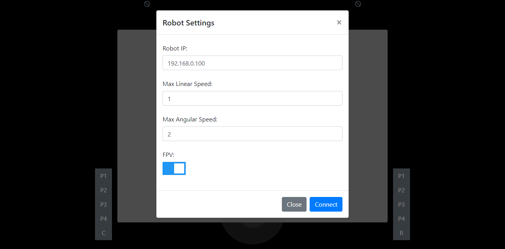
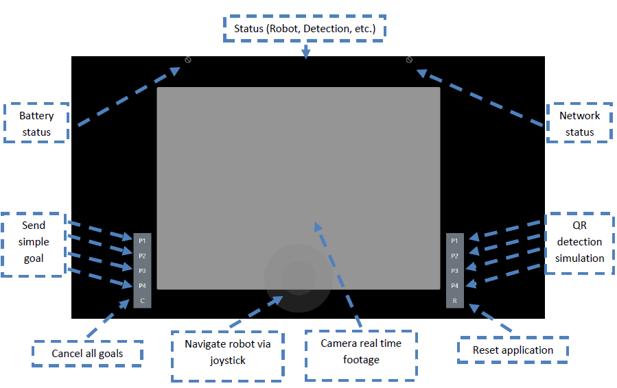
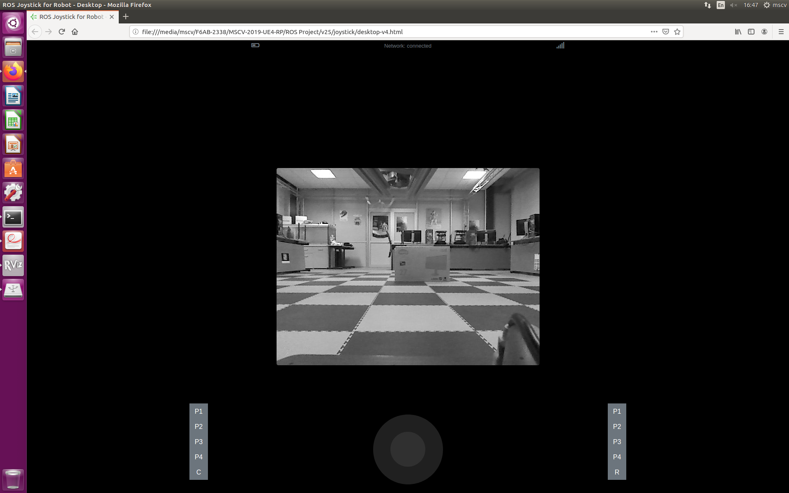
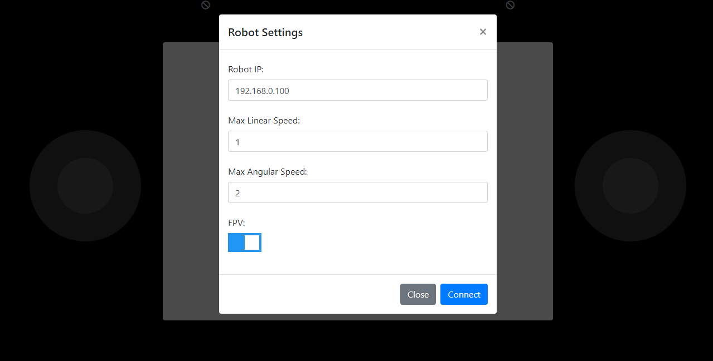
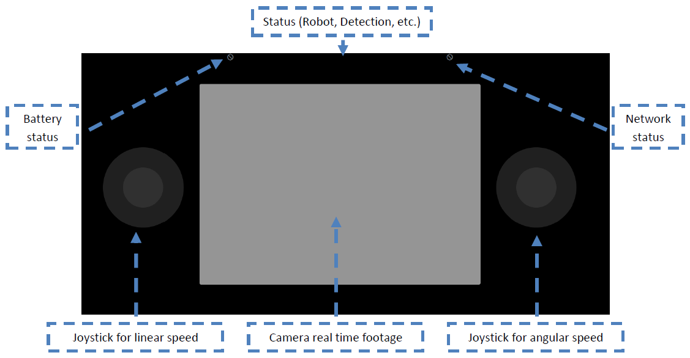

# ROS Joystick

ROS Joystick is a Hybrid Application, for remote controlling and monitoring of a robot that runs ROS. Also, it publishes and subscribes to different topics for sending goals, monitoring the robot status and the live view of the robot camera. (This implementation has tested only with ROS Kinetic version) 

## Table of Contents

[Getting Started](#getting-started)

[Executing](#executing)

[Screenshots](#screenshots)

[Demo](#demo)

[License](#license)

## Getting Started

### Download the Source of Project

Download repository code from:

``` https://github.com/georgealexakis/ros-joystick.git (master branch) ```

Or get a copy of the source from:

``` $ git clone https://github.com/georgealexakis/ros-joystick.git (master branch) ```

Normally, you have to run:

``` npm install ```

to install dependencies, but I have already included them in all projects.

### Install Package

To connect ROS Joystick with ROS robot, it is necessary to install rosbridge. Run the command below:

``` $ sudo apt-get install ros-<version>-rosbridge-server ```

## Executing

Connect to the same network with the ROS implemented robot. Run rosbridge with:

``` $ roslaunch rosbridge_server rosbridge_websocket.launch ```

Copy the IP that rosbridge package provides via WebSockets and then:

* Run desktop.html to start the desktop web application to a web browser.

Or

* Use the Android Application in [/build](https://github.com/georgealexakis/ros-joystick/tree/master/build) folder, which runs only on Android Devices.

Or

* Build the Hybrid Applications for different devices using Apache Cordova, Adode Phonegab (mobile devices) with the files in [/hybrid](https://github.com/georgealexakis/ros-joystick/tree/master/hybrid) folder or use Electron (desktop applications, [download the prebuild version for win32-x64](https://1drv.ms/u/s!Amy4EDOPS0vX0k0P5e78r-Kaw89Q?e=91mkWS)). 

## Screenshots

### Desktop Controller







### Smartphone Controller






## Demo

[ROS Joystick Demo.](https://1drv.ms/v/s!Amy4EDOPS0vXuCfv7OUddIGczeXt?e=wpxqIQ)

## License

This project is licensed under the MIT License - see the [LICENSE.md](LICENSE.md) file for details.


