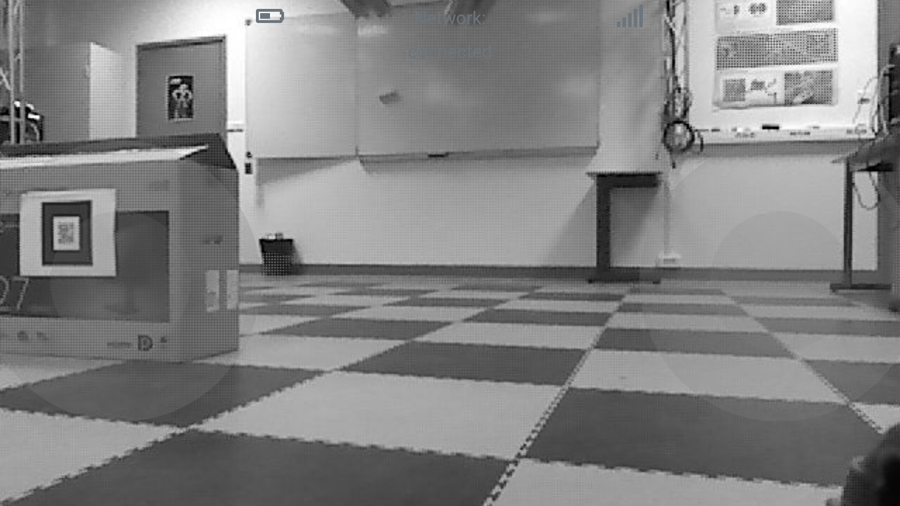

# ROS Joystick

ROS Joystick is a Hybrid Application, for remote controlling and monitoring of a robot that runs ROS. Also, it publishes and subscribes to different topics for sending goals, monitoring the robot status and the live view of the robot camera. (This implementation has tested with ROS Kinetic and ROS Melodic versions). 

## Table of Contents

[Getting Started](#getting-started)

[Execution](#execution)

[Screenshots](#screenshots)

[Demo](#demo)

[License](#license)

## Getting Started

### Source of Project

Download repository code from:

``` https://github.com/georgealexakis/ros-joystick.git (master branch) ```

Or get a copy of the source from:

``` $ git clone https://github.com/georgealexakis/ros-joystick.git (master branch) ```

Run:

``` $ npm install ```

to install dependencies.

### Package Installation

To connect ROS Joystick with ROS robot, it is necessary to install [rosbridge](https://wiki.ros.org/rosbridge_suite). Run the command below:

``` $ sudo apt-get install ros-<version>-rosbridge-server ```

## Execution

Connect to the same network with the ROS implemented robot. Run rosbridge with:

``` $ roslaunch rosbridge_server rosbridge_websocket.launch ```

Copy the IP that rosbridge package provides via WebSockets and then:

* Run desktop.html to start the desktop web application to a web browser.

Or

* Use the Android Application in [/build](https://github.com/georgealexakis/ros-joystick/tree/master/build) folder, which runs only on Android Devices.

Or

* Build the Hybrid Applications for different devices using Apache Cordova for mobile devices. Rename /docs folder to /www folder before build. Use the template for a cordova application, as presented in this repository 
[https://github.com/apache/cordova-app-hello-world](https://github.com/apache/cordova-app-hello-world).
* Build the Hybrid Applications for Windows by using Electron (desktop applications, [download the prebuild version for win32-x64](https://1drv.ms/u/s!Amy4EDOPS0vX2RVVjxyZUtRpEQcI?e=pflxv6)).

Put the computer IP and press connect. When everything is ready the terminal will show the message "Client connected. 1 client total." as is presented below:

<p align="center">
    
    
</p>

## Screenshots

### Desktop Controller


### Smartphone Controller




## Demo

[ROS Joystick Demo.](https://1drv.ms/v/s!Amy4EDOPS0vX2Rbj4Z-S_cIydRii?e=96i5j1)

## License

This project is licensed under the MIT License - see the [LICENSE](LICENSE) file for details.


